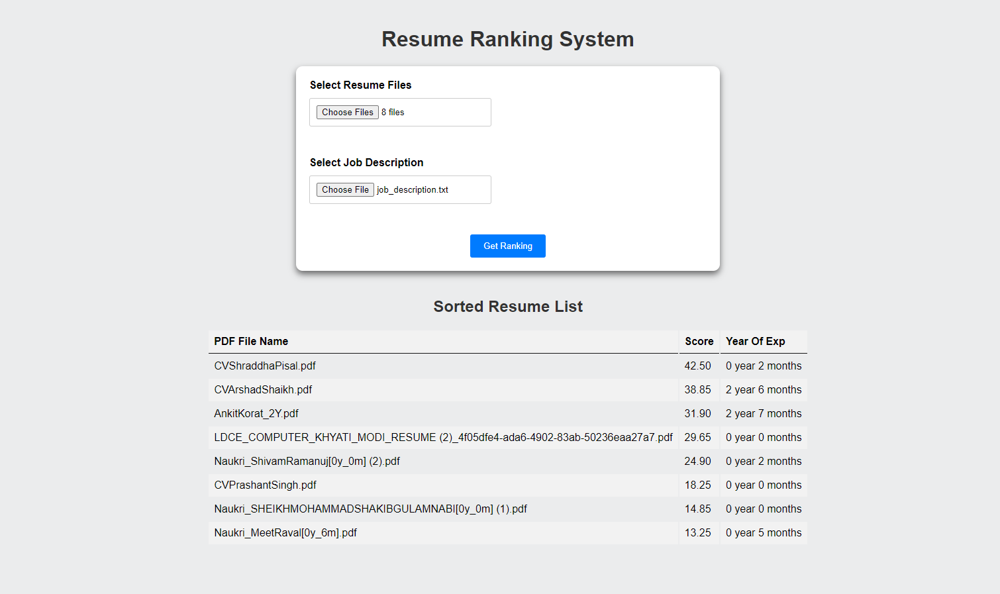

# Resume Ranking System

This project is a resume ranking system that aims to assist recruiters and HR professionals in evaluating job applications more efficiently. The system takes a list of resumes and a job description as input, and then generates a ranked list of resumes based on their relevance to the job requirements.

## Features

-   Upload and select a list of resumes: The system allows you to upload a file containing multiple resumes. It supports popular formats such as PDF, Word documents, and plain text files. You can also manually select the resumes from a predefined list.
    
-   Enter job description: You can enter the job description or requirements either by typing it directly into the system or by uploading a file containing the job description. This information is used as a basis for ranking the resumes.
    
-   Resume ranking: The system employs natural language processing techniques to analyze the content of both the resumes and the job description. It then compares the qualifications, skills, and experience mentioned in the resumes with the job requirements and assigns a relevance score to each resume.
    
    

## Setup and Usage

To run the application and view the user interface:

1.  Make sure you have Python 3.x installed on your system.
2.  Install the required Python dependencies by running `pip install -r requirements.txt`.
3.  Place your resume files in the `Resumes/` directory or provide a file path to the resume list in the `app.py` file.
4.  Start the application by running `python app.py`.
5.  Open a web browser and navigate to `http://localhost:5000` to access the user interface.

Follow the instructions provided on the UI to upload or select the resumes and enter the job description. Once the ranking process is complete, the results will be displayed on the `index.html` page.

## Demo 

## Notes

-   This system uses natural language processing techniques and algorithms to rank resumes based on their relevance to the job description. While it can provide valuable insights, it is not a definitive measure of a candidate's suitability for a role. Always exercise your judgment and consider other factors when making hiring decisions.
    
-   The system supports various resume formats, but for the best results, it's recommended to use resumes in plain text format.
    
-   The accuracy of the resume ranking process depends on the quality and completeness of both the resumes and the job description. Make sure the information provided is accurate and comprehensive.
    
-   You can customize the appearance and layout of the `index.html` page by modifying the HTML and CSS files in the `templates/` and `static/` directories, respectively.
    

## License

This project is licensed under the [MIT License](https://opensource.org/license/mit/).

Feel free to contribute, report issues, or suggest improvements on the project's GitHub repository: [https://github.com/Uttampatel1/Resume_ranking_system](https://github.com/Uttampatel1/Resume_ranking_system).